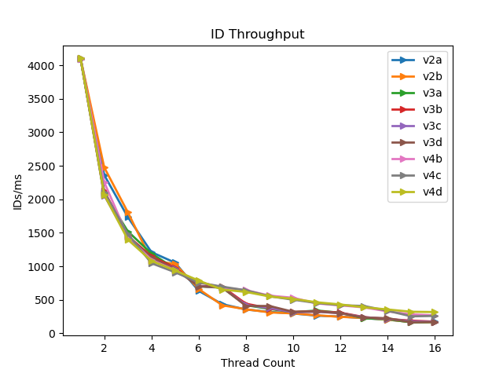
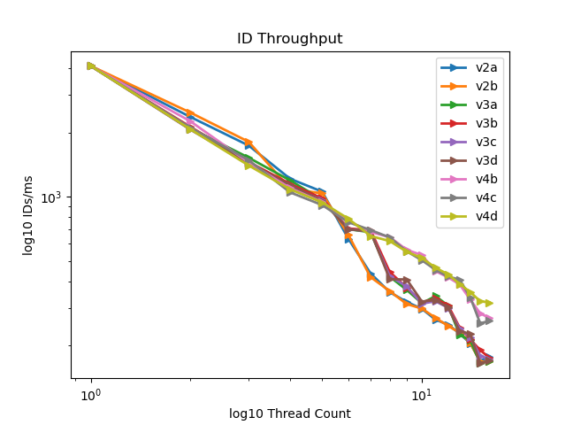
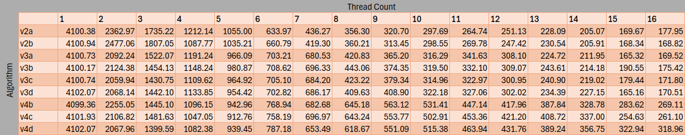

# Lock Free Snowflake
A novel, lock-free, multithreaded implementation of a unique, roughly time-ordered, 64-bit id generator for use in distributed server and database systems. Header-only library.

## Contents
1. [Terminology](#terminlogy)
1. [Abstract](#abstract)
1. [Design Constraints](#design-constraints)
1. [Implementation](#implementation)
1. [Usage](#usage)
1. [Performance](#performance)
1. [Building Tests](#building-tests)

## Terminlogy
**Snowfake ID** - a unique, roughly time-ordered, 64-bit unsigned integer identifier for use in database systems.

**Output Sequence** - a sequence of Snowflake IDs that are produced by the algorithm. 

**Server** - a multithreaded machine (or collection of such) running one or more server application instances

**Process** - an instance of a server application running on a server

**Timestamp** - time in milliseconds from UNIX epoch (or custom epoch).

**Machine Process ID** - or MPID is a unique ID for a machine the server process it is running. A machine may run more than one server process as long as each server process has a unique MPID. All threads on a process share the same MPID.

**Sequence number** - a unique per-millisecond number that is shared between threads on a single process. This number is reset to 0 on the start of a new millisecond.

## Abstract
Snowflake IDs are a 64-bit unique number that can be used to represent any object within distributed server and database systems. A snowflake is generally comprised of three parts: a timestamp, a machine-process ID, and a per-millisecond sequence number. 

Common methods of generating snowflakes utilize a single daemon running a snowflake algorithm. Other server threads may query the generator daemon at any time for a new id without worrying about uniqueness.

Using this approach, however, involves a significant overhead with the interprocess communication for requesting and transfering Snowflake IDs.

My solution to this problem is to run the generation algorithm on each thread by making clever use of atomic synchronization operations. This solution achieves low overhead, high throughput, while maintaining the desired behavior.

## Design Constraints
1. Every generated **Snowflake** must be unique among all **process** among all **servers** 
2. No repeat process IDs, all **servers** and their **process** must have unique **process** IDs. Threads within a single **process** must have shared the same process IDs. 
3. No repeat **sequence number**s within the same **process** within the same millisecond
4. The **sequence number** must reset on the edge of each millisecond
5. No use of locks (mutexes, semaphores, or otherwise)
6. All operations on the shared **sequence number** must be atomically synchonized between threads on the same process.

## Implementation
My implementation uses the same format as Twitter's Snowflake implementation:
```bash
# Snowflake is stored in the following format:
|--1 bit--|--41 bit timestamp--|--10 bit MPID--|--12 bit sequence number--|
# 64 bit snowflake (frontmost bit not used)
|----------------------------64 bit snowflake-----------------------------|
```
The sequence number is a 12 bit number within the range [0, 4,095]

The Machine-Process ID (MPID) is a 10 bit number within the range [0, 1,023]

The Timestamp (in milliseconds) is a 41 bit number that resets in about 70 years.

The last bit is unused because database systems may treat an unsigned 64 number incorrectly as a signed 64 bit number.

## Usage
To use the library, you will need to include the following file from the ```/include``` dir in the project dir:
```cc
#include <lfsnowflake/lockfree.h>
```
To use the library, call the ```lf::get``` function with your chosen machine-process ID (MPID):
```cc
#include <lfsnowflake/lockfree.h>

int main() {
  using u64 = std::uint64_t;
  // set the machine-process ID to 0 (ie. machine = 0, process = 0)
  u64 const kMpid = 0ull;
  // create a unique snowflake
  u64 const snowflake = lf::getSnowflake(kMpid);
  assert((snowflake != 0ull) && "Received invalid snowflake");
  // do something with the snowflake...
  return 0;
}
```
The library provides utilities to decompose each snowflake ID into its components if desired:
```cc
#include <lfsnowflake/lockfree.h>

int main() {
  using u64 = std::uint64_t;
  // set the machine-process ID to 0 (ie. machine = 0, process = 0)
  u64 const kMpid = 0ull;
  // create a unique snowflake
  u64 const snowflake = lf::getSnowflake(kMpid);
  assert((snowflake != 0ull) && "Received invalid snowflake");
  // decompose the snowflake: extract the timestamp
  u64 const timestamp = lf::utils::getTimestamp(snowflake);
  // extract the
  u64 const mpid = lf::utils::getMpid(snowflake);
  assert((mpid == kMpid) && "Snowflake mpid must equal the input");
  // extract the sequence number
  u64 const sequenceNumber = lf::utils::getSequence(snowflake);
}
```

## Performance
This library contains a number of lockfree algorithms that were tested for multithreaded use for ```t=1``` to ```t=16```. Tests of generating ```4,096,000``` ids total were run for each algorithm. The results of the tests are shown below with IDs per millisecond on the y-axis (higher is better) vs thread count on the x-axis.*





The table below shows the results from the testing.



From these tests, it is clear that the ```lockfree::v4d``` algorithm is the superior algorithm, meeting all design constraints with the highest snowflake ID throughput for most use cases. This algorithm is provided by default with the library for use in your program.

*algorithms that failed to meet the design constraints are omitted from the results.

## Building Tests
Clone the repo to your machine and pull the required submodules
```bash
cd path/to/cwd
git clone https://github.com/khelmka25/lock-free-snowflake
cd lock-free-snowflake
git submodule update --init --recursive
```

Create and open the build folder
```bash
mkdir build
cd build
```
Using cmake and make, build the program (you will need cmake, make (or otherwise), and a C++20 compatible compiler)
```bash
cmake ..
make
```
After building the program, it may be used with the following commands:
```bash
./snowflake_test PARAMS
# where PARAMS is one or more of the following:
-h          # print help screen and exit
-t <n>      # number of threads to run the tests with
-i <n>      # number of ids to generate per thread
-I <n>      # number of total ids to generate
-lf         # test the lockfree algorithms
```